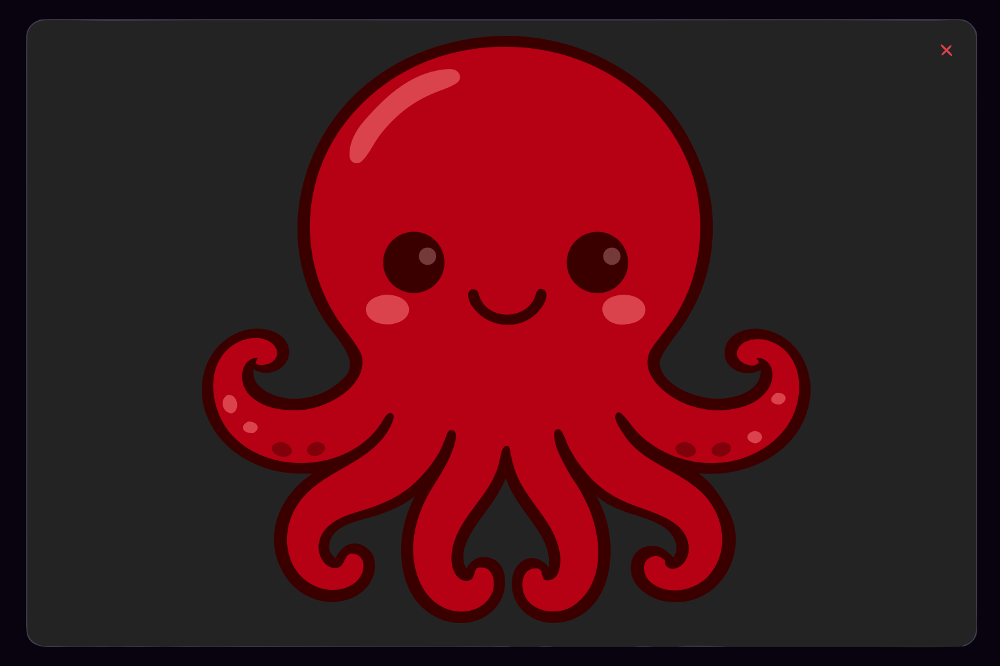

# Octopal

<p align="center">
  
</p>

<p align="center">
  <strong>Chat with your .octo agents</strong><br />
  Load a folder, talk to AI agents in a group room.
</p>

<p align="center">
  
  
  
  
</p>

---

## What is Octopal?

Octopal is an Electron-based group-chat messenger for AI agents. Each agent is a `.octo` JSON file that lives in your project folder — think of it as a virtual coworker with its own role, memory, and conversation history.

- **Group chat interface** — Talk to multiple agents at once, or `@mention` a specific one
- **Persistent agents** — Close the app, come back days later; memory and history are still there
- **Folder-based workspaces** — Each folder is a project; `.octo` files inside are your team
- **Powered by Claude** — Agents run on Anthropic's Claude via the Claude CLI

## Features

- Multi-agent group chat with `@mention` routing
- Dark theme UI with real-time streaming responses
- Agent creation, editing, and role management
- Automatic agent chaining (hidden dispatcher)
- Unicode mention support (Korean, Japanese, etc.)
- Workspace switching with folder management
- Background processing without throttling

## Getting Started

```bash
# Install dependencies
npm install

# Development mode
npm run dev

# Production build & run
npm run prod
```

## Tech Stack

| Layer | Tech |
|-------|------|
| Desktop | Electron |
| Frontend | React 18 + TypeScript |
| Build | Vite |
| AI Engine | Claude CLI (claude) |
| Styling | Inline CSS (dark theme) |

## Project Structure

```
Octopal/
  assets/         # Logo, icons
  character/      # Character SVG sources
  renderer/       # React frontend (Vite)
    src/
      App.tsx         # Main app + agent orchestration
      ChatPanel.tsx   # Chat UI + mention system
      main.tsx        # React entry point
  src/
    main.ts       # Electron main process
    preload.ts    # IPC bridge
  *.octo          # Agent files (coworkers)
```

## License

Private — Studio H
