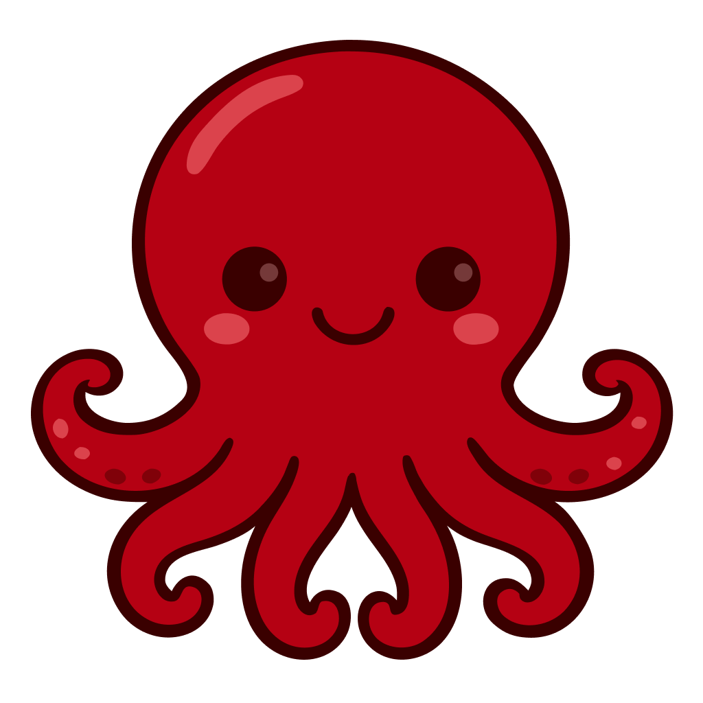
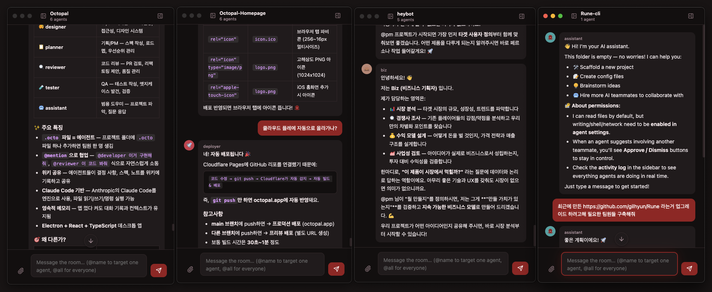

# Octopal

<p align="center">
  
</p>

<p align="center">
  <strong><span style="font-size: 3.8em;">My PC is my Company.</span></strong><br />
  An agentic workplace messenger for Claude Code.<br />
  No servers, no accounts — just your PC and a team of AI agents.
</p>

<p align="center">
  
  
  
  
  
  
</p>

<p align="center">
  🌐 <a href="https://octopal.app"><strong>octopal.app</strong></a> &nbsp;|&nbsp;
  <strong>English</strong> | <a href="README.ko.md">한국어</a>
</p>

<p align="center">
  
</p>

---

## What is Octopal?

Octopal is a multi-agent workplace messenger that runs on top of Claude Code. It's built for power users who work on multiple projects simultaneously.

Create a workspace, import your project folders, add agents, and start group chatting with your AI team — all in seconds.

All agent data is stored as `.octo` files in your project folder — everything lives inside the file. As long as you have the `.octo` file, you can pick up the conversation from anywhere.

## Philosophy

> **My PC is my Company.**

**One simple metaphor, zero infrastructure.**

Octopal's uniquely simple structure turns familiar concepts into a powerful AI workplace. No servers, no accounts — everything lives on your machine.

| Concept | Becomes | Description |
|---------|---------|-------------|
| 📁 Folder | **Team** | Each folder becomes an independent team with its own agents and context. |
| 📄 .octo File | **Agent** | A single JSON file defines an agent — its role, memory, and personality. |
| 🏢 Workspace | **Company** | Group your folders into a workspace and you have your own AI company. |

No complex setup, no cloud — just your computer and your AI company.

## Highlights

| | Feature | Description |
|---|---------|-------------|
| 🐙 | **Octo Agents** | Define agents as simple `.octo` files. Each file is an independent agent with its own role, personality, and capabilities. |
| 💬 | **Group Chat** | Agents talk to each other and to you in a natural group chat. @mention to direct, or let the orchestrator route automatically. |
| 🧠 | **Hidden Orchestrator** | A smart orchestrator reads the context and calls the right agent at the right time. You direct, agents collaborate. |
| 📁 | **Your Folders, Your Teams** | Each folder is a team, each workspace is a company. Organize agent teams the way you already organize files. |
| 🔗 | **Agent-to-Agent** | Agents can @mention each other, triggering chain reactions of collaboration without your intervention. |
| 🔒 | **Local-first, Privacy-first** | Everything runs on your machine. No cloud servers, no data collection — your agents, your files, your control. |

## How It Works

1. **Open Octopal App** — Launch the app and open a workspace. That's your company — ready in seconds.
2. **Add a Folder** — Add a folder and drop in `.octo` files. Each folder is a team, each file is an agent — alive and ready to work.
3. **Create Agents & Chat** — Give each agent a role and start chatting. @mention who you need, or let the orchestrator route the conversation.

## Features

### Chat
- Multi-agent group chat — A hidden mediator agent automatically summons domain-expert agents that can answer your questions.
- `@mention` routing, `@all` broadcast
- Real-time streaming responses + Markdown rendering (GFM, syntax highlighting)
- Image/text file attachments (drag & drop, paste)
- Consecutive message debouncing (1.2s buffer before agent invocation)
- Message pagination (loads 50 messages on scroll-up)

### Agent Management
- Create/edit/delete agents (name, role, emoji icon, color)
- Granular permission control (file write, shell execution, network access)
- Path-based access control (allowPaths / denyPaths)
- Agent handoff & permission request UI
- Automatic dispatcher routing

### Wiki
- Shared knowledge base per workspace — notes, decisions, and context accessible to all agents and sessions
- Markdown page CRUD (create, read, update, delete)
- Real-time editing with live preview
- All agents in the same workspace can read and write wiki pages
- Persistent across sessions — wiki pages survive app restarts

### Workspace
- Create/rename/delete workspaces
- Multi-folder management (add/remove folders)
- `.octo` file change detection (file system watch)

<p align="center">
  
</p>

## Prerequisites

Octopal requires **Claude CLI** to be installed and logged in on your machine.

```bash
# 1. Install Claude CLI
npm install -g @anthropic-ai/claude-code

# 2. Log in
claude login
```

> Without Claude CLI, Octopal cannot communicate with agents. The app will show a login prompt on startup if Claude CLI is not detected or not logged in.

## Download

👉 **[Download the latest release](https://github.com/gilhyun/Octopal/releases)** (macOS / Windows)

> **⚠️ Note for Windows users**
>
> You may see a security warning when launching the app for the first time.
>
> - **Windows**: _Windows protected your PC_ (SmartScreen) → Click **"More info"** → **"Run anyway"**.

## Getting Started

```bash
# Install dependencies
npm install

# Development mode (Hot Reload)
npm run dev

# Production build
npm run build
```

### Scripts

| Command | Description |
|---------|-------------|
| `npm run dev` | Run Tauri dev mode (Vite + Rust backend with hot reload) |
| `npm run build` | Production build (compiles Rust backend + Vite frontend) |

## Tech Stack

| Layer | Tech |
|-------|------|
| Desktop | Tauri 2 (Rust backend) |
| Frontend | React 18 + TypeScript 5.6 |
| Build | Vite 5 + Cargo |
| AI Engine | Claude CLI |
| Markdown | react-markdown + remark-gfm + rehype-highlight |
| Icons | Lucide React |
| i18n | i18next + react-i18next |
| Styling | CSS (Dark Theme + Custom Fonts) |

> **Why Rust?** Octopal uses [Tauri 2](https://tauri.app) instead of Electron. The Rust-based backend provides significantly smaller binary sizes (~10MB vs ~200MB), lower memory usage, and native OS integration — while keeping the same React + TypeScript frontend.

## Project Structure

```
Octopal/
├── src-tauri/                    # Tauri / Rust backend
│   ├── src/
│   │   ├── main.rs               # App entry point
│   │   ├── lib.rs                # Plugin registration, command routing
│   │   ├── state.rs              # Shared app state
│   │   └── commands/             # Tauri IPC command handlers
│   │       ├── agent.rs          # Agent lifecycle
│   │       ├── claude_cli.rs     # Claude CLI spawn & streaming
│   │       ├── dispatcher.rs     # Message routing / orchestration
│   │       ├── files.rs          # File system operations
│   │       ├── folder.rs         # Folder management
│   │       ├── workspace.rs      # Workspace CRUD
│   │       ├── wiki.rs           # Wiki page CRUD
│   │       ├── settings.rs       # App settings
│   │       ├── octo.rs           # .octo file read/write
│   │       ├── backup.rs         # State backup
│   │       └── file_lock.rs      # File locking
│   ├── Cargo.toml                # Rust dependencies
│   └── tauri.conf.json           # Tauri app configuration
│
├── renderer/src/                 # React frontend
│   ├── App.tsx                   # Root component (state management, agent orchestration)
│   ├── main.tsx                  # React entry point
│   ├── globals.css               # Global styles (dark theme, fonts, animations)
│   ├── types.ts                  # Runtime type definitions
│   ├── utils.ts                  # Utilities (color, path)
│   ├── global.d.ts               # TypeScript global interfaces
│   │
│   ├── components/               # UI components
│   │   ├── ChatPanel.tsx         # Chat UI (messages, composer, mentions, attachments)
│   │   ├── LeftSidebar.tsx       # Workspace/folder/tab navigation
│   │   ├── RightSidebar.tsx      # Agent list & activity status
│   │   ├── ActivityPanel.tsx     # Agent activity log
│   │   ├── WikiPanel.tsx         # Wiki page management
│   │   ├── SettingsPanel.tsx     # Settings (general/agent/appearance/shortcuts/about)
│   │   ├── AgentAvatar.tsx       # Agent avatar
│   │   ├── MarkdownRenderer.tsx  # Markdown renderer
│   │   ├── EmojiPicker.tsx       # Emoji picker
│   │   ├── MentionPopup.tsx      # @mention autocomplete
│   │   └── modals/               # Modal dialogs
│   │
│   └── i18n/                     # Internationalization
│       ├── index.ts              # i18next configuration
│       └── locales/
│           ├── en.json           # English
│           └── ko.json           # Korean
│
└── assets/                       # Logo, icons
```

## Architecture

```
┌──────────────────────────────────────────────┐
│                  Tauri 2                      │
│  ┌─────────────┐         ┌────────────────┐  │
│  │  Rust Core   │  IPC    │   WebView      │  │
│  │  (commands/) │◄───────►│   (React)      │  │
│  │  lib.rs      │ invoke  │   App.tsx      │  │
│  └──────┬──────┘         └───────┬────────┘  │
│         │                        │            │
│    ┌────▼────┐           ┌──────▼──────┐     │
│    │ File    │           │ Components  │     │
│    │ System  │           │ ChatPanel   │     │
│    │ .octo   │           │ Sidebars    │     │
│    │ Wiki    │           │ Modals      │     │
│    │ State   │           │ Settings    │     │
│    └────┬────┘           └─────────────┘     │
│         │                                     │
│    ┌────▼────┐                               │
│    │ Claude  │                               │
│    │ CLI     │                               │
│    │ (spawn) │                               │
│    └─────────┘                               │
└──────────────────────────────────────────────┘
```

## Data Storage

| Item | Path |
|------|------|
| State (Dev) | `~/.octopal-dev/state.json` |
| State (Prod) | `~/.octopal/state.json` |
| Chat history | `~/.octopal/room-log.json` |
| Attachments | `~/.octopal/uploads/` |
| Wiki | `~/.octopal/wiki/{workspaceId}/` |
| Settings | `~/.octopal/settings.json` |

## License

[MIT License](LICENSE) © gilhyun
